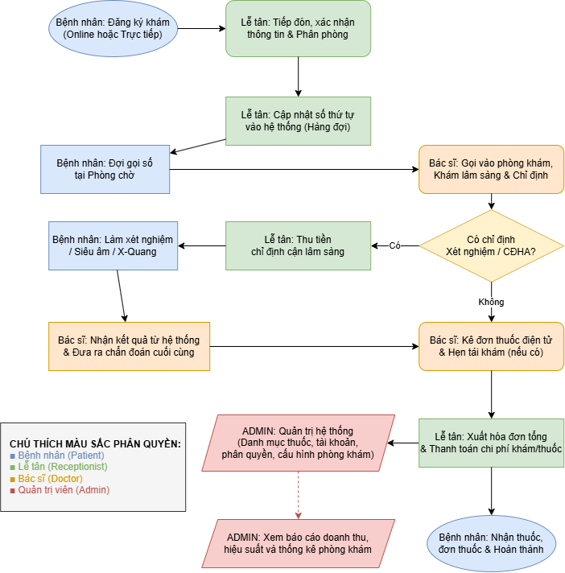

# Hệ thống quản lý phòng khám đa khoa

## 1. Tại sao?

Xây dựng hệ thống nhằm số hóa quy trình quản lý phòng khám,
giảm việc quản lý thủ công và nâng cao hiệu quả làm việc.

## 2. Ai?

Hệ thống phục vụ:

- Bệnh nhân
- Bác sĩ
- Lễ tân
- Quản trị viên

## 3. Tác động

- Bệnh nhân có thể đặt và theo dõi lịch khám.
- Lễ tân quản lý thông tin bệnh nhân và lịch hẹn.
- Bác sĩ quản lý thông tin khám và hồ sơ bệnh án.
- Quản trị viên quản lý người dùng và hệ thống.
- Phòng khám có thể theo dõi trạng thái của từng lượt khám.
- Hồ sơ bệnh án được lưu lại theo thời gian.
- Số lượng thuốc trong kho được theo dõi và cập nhật.

## 4. Bàn giao

Hệ thống cung cấp các chức năng:

- Đăng nhập và phân quyền
- Quản lý bệnh nhân
- Quản lý bác sĩ
- Quản lý lịch hẹn
- Theo dõi trạng thái lượt khám
- Quản lý bệnh án theo thời gian
- Quản lý thuốc và tồn kho

Trương phương nam-2506022012

Mai Đông Duy-2606042062

##  Chi Tiết Workflow Theo Loại User

### 1. Bệnh nhân (Patient)
*   **Điểm bắt đầu:** Có nhu cầu khám bệnh hoặc đến lịch hẹn tái khám.
*   **Các bước thực hiện:**
    *   Đặt lịch khám trực tuyến qua Ứng dụng hoặc Website bằng cách chọn chuyên khoa, bác sĩ phù hợp và khung giờ trống.
    *   Nhận tin nhắn hoặc email xác nhận tự động kèm theo mã QR code để check-in.
    *   Đến phòng khám, quét mã QR tại quầy tự động hoặc đưa cho lễ tân để xác nhận sự có mặt.
    *   Đợi tại khu vực sảnh và vào phòng khám theo số thứ tự hiển thị trên bảng điện tử.
    *   Nhận đơn thuốc điện tử, di chuyển đến quầy thanh toán viện phí và nhận thuốc tại nhà thuốc bệnh viện.
*   **Điểm quyết định:** 
    *   *Nếu bác sĩ chỉ định cận lâm sàng (xét nghiệm, siêu âm, chụp X-quang):* Di chuyển đến phòng kỹ thuật để thực hiện trước, sau đó cầm kết quả quay lại phòng bác sĩ ban đầu.
    *   *Nếu không có chỉ định cận lâm sàng:* Di chuyển đến quầy thanh toán, lấy đơn thuốc và ra về.
*   **Kết quả đầu ra:** Đặt lịch thành công, mã số thứ tự khám, biên lai thanh toán, đơn thuốc điện tử và hồ sơ bệnh án cá nhân được cập nhật.

### 2. Lễ tân (Receptionist)
*   **Điểm bắt đầu:** Bệnh nhân đến quầy trực tiếp hoặc liên hệ qua số hotline của phòng khám.
*   **Các bước thực hiện:**
    *   Tiếp đón bệnh nhân, thực hiện quét mã QR check-in hoặc tìm kiếm thông tin của họ trên phần mềm.
    *   Xác nhận lại thông tin cá nhân (Họ tên, SĐT, CCCD) và lý do đến khám hôm nay.
    *   Thu phí khám bệnh ban đầu tùy theo chuyên khoa đã chọn.
    *   Điều phối và xếp hàng đợi cho bệnh nhân vào đúng phòng khám của bác sĩ chuyên khoa.
    *   Hướng dẫn bệnh nhân vị trí phòng khám, phòng cận lâm sàng hoặc quầy thanh toán/nhận thuốc sau khi khám xong.
*   **Điểm quyết định:** Kiểm tra xem bệnh nhân đã có thông tin trên hệ thống chưa.
    *   *Nếu đã có dữ liệu:* Xác nhận lịch và in số thứ tự.
    *   *Nếu là bệnh nhân mới:* Tiến hành tạo hồ sơ bệnh án điện tử mới (nhập thông tin cá nhân và tiền sử bệnh lý cơ bản).
*   **Kết quả đầu ra:** Phiếu số thứ tự khám của bệnh nhân, trạng thái hàng đợi tại các phòng khám được cập nhật theo thời gian thực trên hệ thống.

### 3. Bác sĩ (Doctor)
*   **Điểm bắt đầu:** Hệ thống phần mềm thông báo có bệnh nhân tiếp theo đang đợi trước cửa phòng khám.
*   **Các bước thực hiện:**
    *   Nhấn nút "Tiếp nhận" trên màn hình để hệ thống tự động gọi tên/số thứ tự của bệnh nhân vào phòng.
    *   Xem trước lịch sử bệnh án điện tử (EMR) của bệnh nhân để nắm thông tin nền.
    *   Khám lâm sàng, hỏi han triệu chứng và ghi nhận trực tiếp các chỉ số, biểu hiện vào phần mềm.
    *   Kê đơn thuốc điện tử hoặc đưa ra các chỉ định cận lâm sàng dựa trên chẩn đoán ban đầu.
    *   Đưa ra kết luận bệnh lý, hướng dẫn phác đồ điều trị, dặn dò sử dụng thuốc và đặt lịch hẹn tái khám nếu cần thiết.
*   **Điểm quyết định:** Đánh giá xem triệu chứng lâm sàng đã đủ rõ ràng để kết luận chưa.
    *   *Nếu đã rõ ràng:* Kê đơn thuốc trực tiếp và kết thúc lượt khám.
    *   *Nếu chưa rõ ràng:* Chọn các danh mục xét nghiệm/chụp chiếu tương ứng trên phần mềm để gửi bệnh nhân đi kiểm tra thêm.
*   **Kết quả đầu ra:** Đơn thuốc điện tử, phiếu chỉ định cận lâm sàng, chẩn đoán bệnh lý và phác đồ điều trị được lưu trữ đồng bộ vào hồ sơ bệnh án điện tử (EMR).

### 4. Quản trị viên (Admin)
*   **Điểm bắt đầu:** Đăng nhập vào trang quản trị hệ thống (Dashboard dành riêng cho Admin).
*   **Các bước thực hiện:**
    *   Giám sát toàn bộ hiệu suất vận hành của phòng khám (theo dõi tổng số ca khám của từng bác sĩ, thời gian chờ trung bình của bệnh nhân).
    *   Quản lý dữ liệu danh mục cốt lõi bao gồm: danh mục các loại thuốc, bảng giá dịch vụ khám, thông tin các chuyên khoa.
    *   Thiết lập lịch làm việc, phân chia ca trực hàng tuần/tháng cho đội ngũ Bác sĩ, Điều dưỡng và Lễ tân.
    *   Khởi tạo tài khoản và phân quyền truy cập chi tiết cho nhân sự mới tùy theo vị trí phòng ban.
    *   Xuất các báo cáo tài chính (doanh thu, chi phí) và báo cáo vận hành định kỳ để gửi cho ban giám đốc.
*   **Điểm quyết định:** Theo dõi xem hệ thống vận hành có gặp sự cố kỹ thuật hoặc tình trạng quá tải cục bộ tại các phòng khám không.
    *   *Nếu có sự cố/quá tải:* Thực hiện điều phối nhân sự dự phòng hoặc liên hệ đội kỹ thuật xử lý lỗi phần mềm.
    *   *Nếu hoạt động bình thường:* Tiếp tục duy trì giám sát tình trạng hoạt động ổn định.
*   **Kết quả đầu ra:** Lịch trực nhân sự được tối ưu hóa, báo cáo tài chính được phê duyệt, hệ thống phần mềm hoạt động ổn định và bảo mật dữ liệu y tế được đảm bảo.

  <b>SƠ ĐỒ QUY TRÌNH PHÒNG KHÁM</b>
     
    
  

# BÀI TẬP LỚN: ĐẶC TẢ YÊU CẦU PHẦN MỀM (SRS)
## HỆ THỐNG QUẢN LÝ PHÒNG KHÁM ĐA KHOA 

---

## I. DANH SÁCH CÁC ĐỐI TƯỢNG (ACTORS) TRONG HỆ THỐNG
Để hệ thống vận hành không bị gãy luồng dữ liệu, dự án bao gồm 7 đối tượng sau:
1. **Bệnh nhân (Patient):** Đặt lịch, check-in, tra cứu kết quả.
2. **Lễ tân (Receptionist):** Tiếp đón, tạo hồ sơ mới, thu phí khám ban đầu, cấp STT.
3. **Bác sĩ (Doctor):** Khám bệnh, chỉ định cận lâm sàng, kê đơn thuốc, kết luận.
4. **Kỹ thuật viên Cận lâm sàng (Technician):** Thực hiện xét nghiệm/chụp chiếu, trả kết quả.
5. **Thu ngân (Cashier):** Thu phí cận lâm sàng, tiền thuốc, xử lý hóa đơn.
6. **Dược sĩ / Nhân viên nhà thuốc (Pharmacist):** Kiểm tra đơn thuốc, cấp phát thuốc, trừ tồn kho.
7. **Quản trị viên (Admin):** Cấu hình danh mục, chia lịch trực, phân quyền, xem báo cáo doanh thu.

---

## II. ĐẶC TẢ CHỨC NĂNG THEO TỪNG ĐỐI TƯỢNG

### 1. Phân hệ Bệnh nhân (Patient Module)
*   **[FR-PT-01] Đặt lịch trực tuyến:** Chọn Chuyên khoa -> Bác sĩ -> Ngày/Giờ trống trên Web/App.
*   **[FR-PT-02] Nhận mã QR xác nhận:** Hệ thống tự động gửi Email/SMS mã QR Code sau khi đặt lịch thành công.
*   **[FR-PT-03] Tự Check-in:** Quét mã QR tại Kiosk tự động để xác nhận đã đến, hệ thống tự in số thứ tự (STT) và đẩy vào hàng đợi của Lễ tân.
*   **[FR-PT-04] Tra cứu cá nhân:** Đăng nhập để xem lại Đơn thuốc, Kết quả khám và Lịch sử hóa đơn.

### 2. Phân hệ Lễ tân (Receptionist Module)
*   **[FR-RC-01] Tiếp đón & Kiểm tra hồ sơ:** Quét mã QR check-in hoặc tìm kiếm bằng SĐT/CCCD.
    *   *Nếu là bệnh nhân cũ:* Hệ thống hiển thị thông tin cũ, Lễ tân nhập lý do khám hiện tại.
    *   *Nếu là bệnh nhân mới:* Lễ tân nhập thông tin bắt buộc (Họ tên, Ngày sinh, Giới tính, SĐT). Hệ thống tự sinh mã `Patient ID`.
*   **[FR-RC-02] Thu phí ban đầu & Cấp STT:** Thu tiền khám lâm sàng, hệ thống tự động xếp bệnh nhân vào hàng đợi phòng khám chuyên khoa (theo nguyên tắc ai đến trước khám trước - FIFO).

### 3. Phân hệ Bác sĩ (Doctor Module)
*   **[FR-DR-01] Gọi bệnh nhân vào phòng:** Xem danh sách chờ và nhấn "Tiếp nhận". Màn hình LED trước cửa phòng tự động hiển thị STT của bệnh nhân được gọi.
*   **[FR-DR-02] Ghi nhận khám lâm sàng:** Tra cứu lịch sử bệnh án cũ, nhập triệu chứng, đo chỉ số sinh tồn (mạch, huyết áp).
*   **[FR-DR-03] Ra chỉ định (Điểm quyết định):**
    *   *Nhánh 1 (Cần xét nghiệm/chụp chiếu):* Tích chọn danh mục Cận lâm sàng (CLS) -> Gửi chỉ định. Ca khám chuyển sang trạng thái "Chờ kết quả CLS".
    *   *Nhánh 2 (Triệu chứng rõ ràng):* Bỏ qua CLS, chuyển thẳng sang màn hình Kê đơn thuốc.
*   **[FR-DR-04] Kê đơn thuốc & Kết luận:** Chọn thuốc từ danh mục có sẵn trong kho, nhập liều dùng. Hệ thống cảnh báo nếu trùng tiền sử dị ứng. Nhập chẩn đoán bệnh (mã ICD-10) và bấm "Hoàn thành".

### 4. Phân hệ Kỹ thuật viên CLS (Technician Module) - *Bổ sung bắt buộc*
*   **[FR-TN-01] Tiếp nhận chỉ định CLS:** Xem danh sách bệnh nhân được bác sĩ gửi sang, tiến hành lấy mẫu (máu/nước tiểu) hoặc chụp chiếu (X-quang/Siêu âm).
*   **[FR-TN-02] Cập nhật kết quả:** Nhập các chỉ số xét nghiệm hoặc tải file ảnh chụp lên hệ thống -> Nhấn "Phê duyệt". Kết quả tự động đồng bộ thời gian thực ngược về màn hình của Bác sĩ ban đầu.

### 5. Phân hệ Thu ngân (Cashier Module) - *Bổ sung bắt buộc*
*   **[FR-CH-01] Tính toán viện phí tổng hợp:** Load mã bệnh nhân để hiển thị các chi phí phát sinh (tiền dịch vụ CLS, tiền đơn thuốc).
*   **[FR-CH-02] Xử lý thanh toán & Xuất hóa đơn:** Hỗ trợ quét mã VietQR động hoặc tiền mặt. Sau khi xác nhận thanh toán thành công, hệ thống chuyển trạng thái Đơn thuốc thành "Đã thanh toán - Chờ phát thuốc" và in biên lai.

### 6. Phân hệ Dược sĩ / Nhà thuốc (Pharmacist Module) - *Bổ sung bắt buộc*
*   **[FR-PH-01] Tiếp nhận đơn thuốc:** Hệ thống hiển thị danh sách các đơn thuốc đã được Thu ngân xác nhận thanh toán thành công.
*   **[FR-PH-02] Xuất thuốc & Trừ tồn kho:** Dược sĩ soạn thuốc theo đơn, dán nhãn hướng dẫn và nhấn "Xác nhận cấp phát". Hệ thống tự động trừ số lượng thuốc tương ứng trong Kho dược thực tế.

### 7. Phân hệ Quản trị viên (Admin Module)
*   **[FR-AD-01] Dashboard giám sát:** Biểu đồ hiển thị số lượng ca khám trong ngày và thời gian chờ trung bình tại các khâu. Phát cảnh báo đỏ nếu phòng khám bị quá tải.
*   **[FR-AD-02] Quản lý danh mục (Master Data):** Thêm, sửa, xóa danh mục Thuốc, giá dịch vụ khám và thông tin các Chuyên khoa.
*   **[FR-AD-03] Quản lý Lịch làm việc:** Thiết lập ca trực cho Bác sĩ. Lịch này sẽ quyết định các khung giờ trống hiển thị trên App đặt lịch của Bệnh nhân.
*   **[FR-AD-04] Phân quyền tài khoản:** Tạo tài khoản cho nhân viên mới và gán quyền theo chức vụ (Bác sĩ, Lễ tân, Thu ngân...).

---

## III. QUY TẮC NGHIỆP VỤ & KIỂM TRA TƯƠNG THÍCH ĐỒNG BỘ
1. **Quy tắc Mã bệnh nhân:** Mỗi bệnh nhân chỉ có một mã `Patient ID` duy nhất để quản lý bệnh án xuyên suốt từ Lễ tân -> Bác sĩ -> Nhà thuốc.
2. **Quy trình Khép kín:** Dữ liệu chạy tuần tự theo luồng: `Đặt lịch (Patient)` -> `Tiếp đón (Lễ tân)` -> `Khám bệnh (Bác sĩ)` -> `Chụp chiếu (Kỹ thuật viên)` -> `Đóng tiền (Thu ngân)` -> `Lấy thuốc (Dược sĩ)`.
3. **Đồng bộ thời gian thực:** Kết quả từ phân hệ Kỹ thuật viên bắt buộc phải tự động nhảy về màn hình Bác sĩ ngay khi bấm "Phê duyệt" để bác sĩ kết luận, bệnh nhân không cần quay lại quầy lễ tân.
